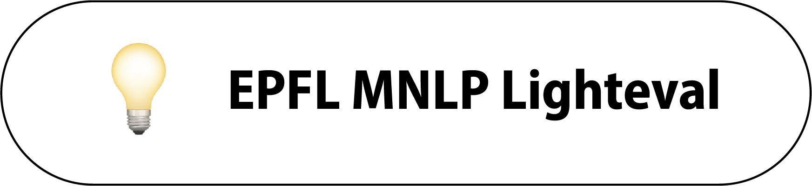

<p align="center">
  <br/>
    
  <br/>
</p>


<p align="center">
    <i>A go-to toolkit for flexible LLM evaluation, adapted from and inspired by Lighteval, RewardBench, & Langchain.</i>
</p>

<!-- <div align="center">

[](https://github.com/huggingface/lighteval/actions/workflows/tests.yaml?query=branch%3Amain)
[](https://github.com/huggingface/lighteval/actions/workflows/quality.yaml?query=branch%3Amain)
[](https://www.python.org/downloads/)
[](https://github.com/huggingface/lighteval/blob/main/LICENSE)
[](https://pypi.org/project/lighteval/)

</div>

--- -->

<!-- **Documentation**: <a href="https://huggingface.co/docs/lighteval/index" target="_blank">Lighteval's Wiki</a> -->

---

### LightEval - EPFL Modern Natural Language Processing 🚀

This evaluation suite is adapted from Huggingface's all-in-one toolkit for evaluating LLMs **Lighteval**, across multiple backends and benchmark types. Dive deep into your model’s performance by saving and exploring detailed, sample-by-sample results to debug and see how your models stack-up.

<!-- Customization at your fingertips: letting you either browse all our existing [tasks](https://huggingface.co/docs/lighteval/available-tasks) and [metrics](https://huggingface.co/docs/lighteval/metric-list) or effortlessly create your own [custom task](https://huggingface.co/docs/lighteval/adding-a-custom-task) tailored to your needs. -->


<!-- ## 🔑 Key Features

- **Speed**: [Use vllm as backend for fast evals](https://huggingface.co/docs/lighteval/use-vllm-as-backend).
- **Completeness**: [Use the accelerate backend to launch any models hosted on Hugging Face](https://huggingface.co/docs/lighteval/quicktour#accelerate).
- **Seamless Storage**: [Save results in S3 or Hugging Face Datasets](https://huggingface.co/docs/lighteval/saving-and-reading-results).
- **Python API**: [Simple integration with the Python API](https://huggingface.co/docs/lighteval/using-the-python-api).
- **Custom Tasks**: [Easily add custom tasks](https://huggingface.co/docs/lighteval/adding-a-custom-task).
- **Versatility**: Tons of [metrics](https://huggingface.co/docs/lighteval/metric-list) and [tasks](https://huggingface.co/docs/lighteval/available-tasks) ready to go. -->


## ⚡️ Installation

First, clone this repo to your home directory:

```bash
git clone https://github.com/eric11eca/lighteval-epfl-mnlp.git
```

Next, install from source with the `quantization` extras:
```bash
cd lighteval-epfl-mnlp
pip install -e .[quantization]  # on h100, you can `pip install -e .[quantization,quantization_fbgemm]` to install fbgemm package
```

Update the transformers version to `4.51.3`:
```bash
pip install transformers==4.51.3
```

<!-- Lighteval allows for many extras when installing, see [here](https://huggingface.co/docs/lighteval/installation) for a complete list. -->

If you want to push results to the Hugging Face Hub or access gated models & private datasets, add your access token as an environment variable:

```shell
huggingface-cli login
```

## 📋 Model Configs

To make model loading and configuration simple, set up a model config for each of the four models you need to implement for M2 and M3. All model config files are already set up for you in the directory `model_configs`: `dpo_model.yaml`, `mcqa_model.yaml`, `quantized_model.yaml`, `rag_model.yaml`. Please modify these files to reflect your model setup for each evaluation.

Inside the `rag_model.yaml` file, in addition to specifying the huggingface repo-id for your LLM, you also have to specify the huggingface repo-id for your document dataset (`docs_name_or_path`) and embedding model (`embedding_model`). For other arguments for RAG, please read the `rag_params` section in the config file for more details.

## 📝 Custom Tasks

To create a custom task that augments the Lighteval tasks, first, create a Python file under the `community_tasks` directory. We have put two example task files there already: `mnlp_dpo_evals.py` and `mnlp_mcqa_evals.py`. You can directly use these two task files for validation evaluation. If you want to evaluate on your dataset, please follow the two example files carefully.

If you want to create your evaluation data, make sure that the dataset follows exactly the format defined by the prompt functions (`preference_pair` & `mmlu_harness`). If you want to have your dataset format, please make sure that you define a new prompt function that will convert a line from your dataset to a document to be used for evaluation. You can then replace the input to the `prompt_function` argument with your newly defined function.

IMPORTANT NOTE: The metrics for MCQA and DPO evaluations have been set. Please do not modify the metrics! MCQA will always use `[Metrics.loglikelihood_acc, Metrics.loglikelihood_acc_norm_nospace]` and DPO will always use `[Metrics.reward_model_acc]`.


## 🚀 Launching Evaluation

To launch the evaluation, first set up the environment variables for accessing and caching with Huggingface:

```shell
# Often default to /home/<user>/.cache/huggingface/hub/
export HF_HOME=<path-to-your-hf-home-cache-dir>
# You can find this token in your user profile on HuggingFace Hub
export HF_TOKEN=<your-hf-hub-token>
```

Please use the following four commands to launch the evaluation of your four models with the Accelerate backend:

```shell
# Evaluating MCQA Model
lighteval accelerate \
    --eval-mode "lighteval" \
    --save-details \
    --override-batch-size <BATCH_SIZE> \
    --custom-tasks "community_tasks/mnlp_mcqa_evals.py" \
    --output-dir "<path-to-your-output-dir>" \
    model_configs/mcqa_model.yaml \
    "community|mnlp_mcqa_evals|0|0"

# Evaluating Quantized Model
lighteval accelerate \
    --eval-mode "lighteval" \
    --save-details \
    --override-batch-size <BATCH_SIZE> \
    --custom-tasks "community_tasks/mnlp_mcqa_evals.py" \
    --output-dir "<path-to-your-output-dir>" \
    model_configs/quantized_model.yaml \
    "community|mnlp_mcqa_evals|0|0"

# Evaluating DPO Model
lighteval accelerate \
    --eval-mode "dpo" \
    --save-details \
    --override-batch-size <BATCH_SIZE> \
    --custom-tasks "community_tasks/mnlp_dpo_evals.py" \
    --output-dir "<path-to-your-output-dir>" \
    model_configs/dpo_model.yaml \
    "community|mnlp_dpo_evals|0|0"

# Evaluating RAG Model
lighteval accelerate \
    --eval-mode "rag" \
    --save-details \
    --override-batch-size <BATCH_SIZE> \
    --custom-tasks "community_tasks/mnlp_mcqa_evals.py" \
    --output-dir "<path-to-your-output-dir>" \
    model_configs/rag_model.yaml \
    "community|mnlp_mcqa_evals|0|0"
```

## 📸 Logging

The evaluation will log the results automatically at the `output_dir` directory you specified, under the `results` directory. The results are saved in a sub-path `<HF_username>/<model_name>`. For example, with the model `meta-llama/Llama-3.2-1B-Instruct`, the results will be saved under `output_dir/results/meta-llama/Llama-3.2-1B-Instruct/`. Because we also set `save-details` details to be true. The sample-wise predictions will also be saved under the `details` directory with the same sub-path format. For example, `output_dir/details/meta-llama/Llama-3.2-1B-Instruct/`.
